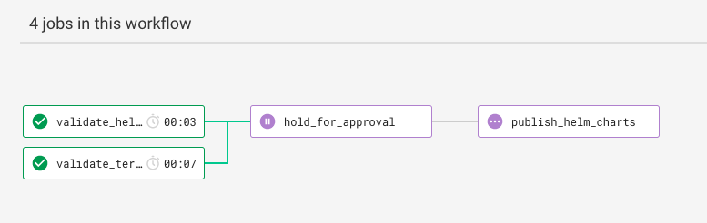
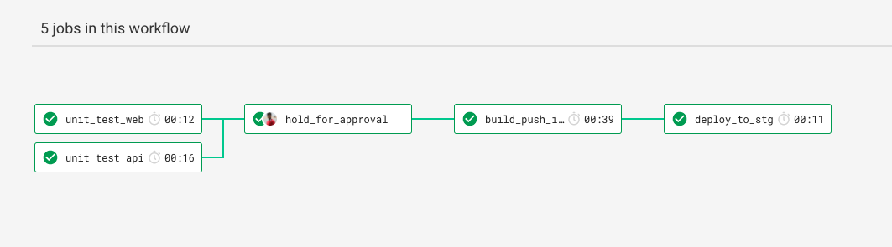

# Infrastructure as a code

[](https://github.com/RichardLitt/standard-readme)


> Infrastructure repository for deploying the cat app

## Few points to be noted:

1. If you want to know about the requirements against this repo is built take a look here [Requirements](Requirements.md)
2. If you want to know about the technologies used, please refer to [Tech Stack](TechStack.md)
3. The app is a very basic one, but the infrastructure is much more complex and can be scaled easily. This could be an over engineering for such a simple app, but this is just a repository to showcase my take on infrastructure. Though its fully functional and throughly tested, please use it with caution in production applications.
4. This repository contains code for creating [Infrastructure in AWS](infrastructure_provisioning/README.md), [Helm charts](charts/README.md) to deploy applications to k8s, [CI/CD](.circleci/config.yml), [Scripts](infrastructure_provisioning/deployer/README.md)
5. This is a public repository and no secrets are stored in the source code. All the secrets are set in the circle ci secret variables.
6. There is a scope to improve a lot. You can find [here](ThingsToImprove.md)
7. Pipeline for Infrastructure

8. Pipeline for Application (Though it is not opensourced yet)


## Table of Contents

- [Infrastructure as a code](#infrastructure-as-a-code)
  - [Few points to be noted:](#few-points-to-be-noted)
  - [Table of Contents](#table-of-contents)
  - [Install](#install)
  - [Usage](#usage)
  - [Maintainers](#maintainers)
  - [Contributing](#contributing)

## Install

1. Install Terraform
```
brew install terraform
```

## Usage

Check the Terraform Guide to run the scripts [here](TerraformGuide.md)
Note: Replace the <aws-account-id> with your actual id in the corresponding chart's values.yml

1. To create all the resources from scratch
```
cd infrastructure_provisioning
./deployer/install.sh all stg
```
2. To create specific resource,
```
cd infrastructure_provisioning
./deployer/install.sh <resource> stg
```
3. To delete all the resources
```
cd infrastructure_provisioning
./deployer/delete.sh all stg
```
4. To delete specific resource
```
cd infrastructure_provisioning
./deployer/delete.sh <resource> stg
```

## Maintainers

[@worldofprasanna](https://github.com/worldofprasanna)

## Contributing

PRs accepted.

Small note: If editing the README, please conform to the [standard-readme](https://github.com/RichardLitt/standard-readme) specification.
